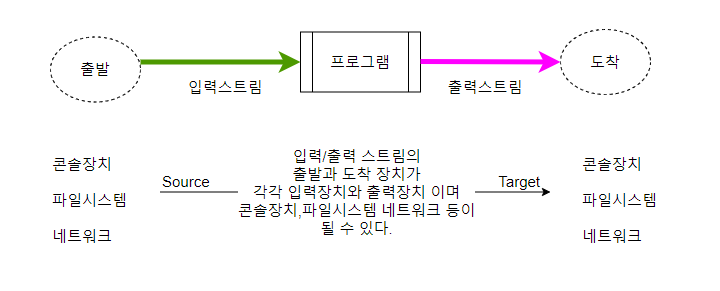

# 입출력 IO
: 입출력(IO, Input/Output)은 프로그램과 외부 환경(파일, 네트워크, 사용자 등) 사이의 데이터 흐름을 다루는 것을 의미합니다. 자바에서는 입출력을 다루기 위해 java.io 패키지를 제공하고 있습니다.입력(IO)은 외부에서 프로그램으로 데이터를 가져오는 과정을 말하며, 출력(IO)은 프로그램에서 외부로 데이터를 보내는 과정을 말합니다. 자바에서의 IO는 스트림(Stream)을 기반으로 동작합니다. 스트림은 연속적인 데이터의 흐름을 나타내는 개념으로, 데이터를 읽을 때는 입력 스트림(Input Stream)을 사용하고, 데이터를 쓸 때는 출력 스트림(Output Stream)을 사용합니다.

## 입력과 출력을 다루는 주요 클래스와 개념
1. **입력 스트림(Input Stream)** : 입력 스트림은 외부에서 프로그램으로 데이터를 읽어들이는 데 사용됩니다. java.io.InputStream 클래스를 상속받은 다양한 구현 클래스들이 있습니다. 예를 들어, 파일에서 데이터를 읽을 때는 FileInputStream, 키보드 입력을 받을 때는 System.in 등이 사용됩니다.
2. **출력 스트림(Output Stream)** : 출력 스트림은 프로그램에서 외부로 데이터를 쓰는 데 사용됩니다. java.io.OutputStream 클래스를 상속받은 다양한 구현 클래스들이 있습니다. 예를 들어, 파일에 데이터를 쓸 때는 FileOutputStream, 콘솔에 데이터를 출력할 때는 System.out 등이 사용됩니다.
3. **Reader와 Writer** : Reader와 Writer는 문자 기반의 입출력을 다루기 위한 클래스들입니다. 문자 데이터를 처리할 때는 java.io.Reader와 java.io.Writer 클래스를 사용합니다. FileReader, FileWriter, BufferedReader, BufferedWriter 등이 문자 기반의 입출력을 지원하는 클래스들입니다.
4. **버퍼(Buffer)** : 버퍼는 입출력 성능을 향상시키기 위해 사용되는 임시 저장 공간입니다. 버퍼를 사용하면 작업이 더 효율적으로 수행될 수 있습니다. 예를 들어, BufferedReader와 BufferedWriter는 내부에 버퍼를 가지고 있어 입출력 성능을 향상시킵니다.
5. **직렬화(Serialization)** : 직렬화는 객체를 바이트 스트림으로 변환하는 과정을 말합니다. 자바에서는 Serializable 인터페이스를 구현한 클래스의 객체를 직렬화할 수 있습니다. 직렬화된 객체는 파일에 저장하거나 네트워크를 통해 전송할 수 있습니다.   

*입출력(IO)는 자바 프로그램에서 데이터를 읽고 쓰는 중요한 작업입니다. 파일 입출력, 표준 입력/출력, 네트워크 통신 등 다양한 상황에서 입출력을 다룰 수 있습니다. java.io 패키지의 클래스와 개념을 이용하여 입출력 작업을 수행할 수 있습니다.*