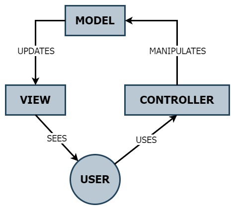
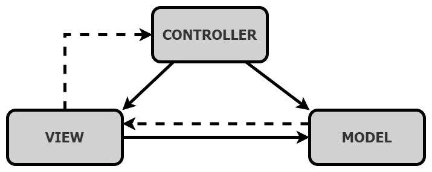

# MVC 란
: MVC 는 Model, View,Controller 의 약자 입니다. 하나의 애플리케이션, 프로젝트를 구성할 때 그 구성요소를 세가지로 역할을 구분한 패턴입니다.

+ 위의 패턴의 구조처럼 사용자가 controller를 조작하면 controller는 model을 통해서 데이터를 가져오고 그정보를 바탕으로 시각적인 표현을 담당하는 view를 제어해서 사용자에게 전달하게 됩니다. 위의 패턴의 구조는 하나의 로직을 설명하는 구조입니다. 

+ MVC 패턴의 구조는 위의 패턴의 구조처럼 Controller 가 view에도 영향을 미치는 부분도 있어야 합니다.

+ 위의 패턴의 구조를 보면 MVC 패턴이 뭔지 감을 잡을수 있습니다. 모델은 컨트롤러에 컨트롤러는 뷰에 뷰는 다시 유저에 유저는 다시 컨트롤러를 향해서 가는 로직입니다.

# MVC
+ MVC (모델-뷰-컨트롤러) 는 사용자 인터페이스, 데이터 및 논리 제어를 구현한느데 널리 사용되는 소프트웨어 디자인 패턴입니다. 소프트웨어의 비즈니스 로직과 화면을 구분하는데 중점을 두고 있습니다. 이러한 **"관심사 분리"** 는 더나은 업무의 분리와 향상된 관리를 제공합니다. MVC 에 기반을 둔 몇 가지 다른 디자인 패턴으로 MVVM(모델-뷰-뷰모델), MVP(모델-뷰-프리젠터),MVW(모델-뷰-왓에버)가 있습니다.
    + 1. Model : 데이터와 비즈니스 로직을 관리합니다.
    + 2. View : 레이아웃과 화면을 처리합니다.
    + 3. Controller : 명령을 모델과 뷰 부분으로 라우팅합니다.

# MVC 사용 이유
: 사용자가 보는 페이지, 데이터처리, 그리고 이 2가지를 중간에서 제어하는 컨트롤, 이 3가지로 구성되는 하나의 애플리케이션을 만들면 각각 맡은바에만 집중을 할 수 있게 됩니다. 서로 분리되어 각자의 역할에 집중할 수 있게끔하여 개발을 하고 그렇게 애플리케이션을 만든다면, 유지보수성, 애플리케이션의 확장성, 그리고 유연성이 증가하고, 중복코딩이라는 문제점 또한 사라지게 되는 것입니다. 
+ 유연성 : 여기서 유연성이라는 것은 클라이언트의 새로운 요구사항에 대해 최소한의 비용으로 보다 유연하게 대처할 수 있는 것을 말합니다.
+ 비즈니스 로직 : 프로그램의 논리구조

# 모델(Model)
: 애플리케이션의 정보, 데이터를 나타냅니다. 데이터베이스, 처음의 정의하는 상수, 초기화값, 변수 등을 뜻합니다. 또한 이런 DATA, 정보들의 가공을 책임지는 컴포넌트를 말합니다.

## 모델(Model) 규칙
+ 1. 사용자가 편집하길 원하는 모든 데이터를 갖고 있어야 한다. 
    + 즉, 화면안의 네모박스에 글자가 표현된다면, 네모박스의 화면 위치 정보, 네모박스의 크기정보, 글자내용, 글자의 위치, 글자의 포맷 정보 등을 가지고 있어야 한다는 것입니다.
+ 2. 뷰나 컨트롤러에 대해서 어떤 정보도 알지 말아야 한다.
    + 데이터 변경이 일어났을 때 모델에서 화면 UI를 직접 조정해서 수정할 수 있도록 뷰를 참조하는 내부 속성값을 가지면 안 된다는 말입니다.
+ 3. 변경이 일어나면, 변경 통지에 대한 처리방법을 구현해야만 한다.
    + 모델의 속성 중 텍스트 정보가 변경이 된다면, 이벤트를 발생시켜 누군가에게 전달해야 하며, 누군가 모델을 변경하도록 요청하는 이벤트를 보냈을 때 이를 수신할 수 있는 처리 방법을 구현해야 합니다. 또한 모델은 재사용가능해야 하며 다른 인터페이스에서도 변하지 않아야 합니다.

# 뷰(View)
: input 텍스트, 체크박스 항목 등과 같은 사용자 인터페이스 요소를 나타냅니다. 다시 말해 데이터 및 객체의 입력, 그리고 보여주는 출력을 담당합니다. 데이터를 기반으로 사용자들이 볼 수 있는 화면입니다.

## 뷰(View) 규칙
+ 1. 모델이 가지고 있는 정보를 따로 저장해서는 안된다.
    + 화면에 글자를 표시 하기 위해, 모델이 가지고 있는 정보를 전달받게 될텐데, 그 정보를 유지하기 위해서 임의의 뷰 내부에 저장하면 안됩니다. 단순히 네모 박스를 그리라는 명령을 받으면, 화면에 표시하기만 하고 그 화면을 그릴 때 필요한 정보들은 저장하지 않아야 합니다.
+ 2. 모델이나 컨트롤러와 같이 다른 구성요소들을 몰라야 한다.
    + 모델과 같은 자기 자신의 빼고는 다른 요소는 참조하거나 어떻게 동작하는지 알아서는 안됩니다. 그냥 뷰는 데이터를 받으면 화면에 표시해주는 역할만 가진다고 보면 됩니다.
+ 3. 변경이 일어나면 변경통지에 대한 처리방법을 구현해야만 한다.
    + 모델과 같이 변경이 일어났을 때 이른 누군가에게 변경을 알여줘야 하는 방법을 구현해야 합니다. 뷰에서는 화면에서 사용자가 화면에 표시된 내용을 변경하게 되면 이를 모델에게 전달해서 모델을 변경해야 할 것이다. 그 작업을 하기 위해 변경 통지를 구현합니다. 그리고 재사용 가능하게끔 설계를 해야 하며 다른 정보들을 표현할 때 쉽게 설계를 해야 합니다.

# 컨트롤러(Controller)
: 데이터와 사용자인터페이스 요소들을 이어주는 다리역할을 합니다. 즉, 사용자가 데이터를 클릭하고, 수정하는 것에 대한 **"이벤트"** 들을 처리하는 부분을 뜻합니다. 

## 컨트롤러(Controller) 규칙
+ 1. 모델이나 뷰에 대해서 알고 있어야 한다.
    + 모델이나 뷰는 서로 존재를 모르고, 변경을 외부로 알리고, 수신하는 방법만 가지고 있는데 이를 컨트롤러가 중재하기 위해 모델과 그에 관련된 뷰에 대해서 알고 있어야 합니다.
+ 2. 모델이나 뷰의 변경을 모니터링 해야 한다.
    + 모델이나 뷰의 변경 통지를 받으면 이를 해석해서 각각의 구성 요소에게 통지를 해야 합니다. 또한, 애플리케이션의 메인 로직은 컨트롤러가 담당하게 됩니다.

