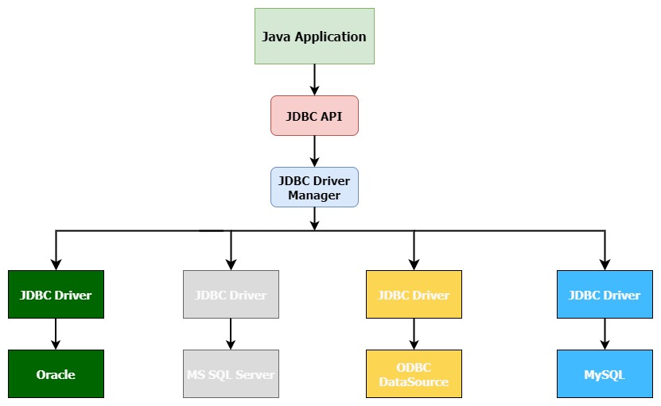
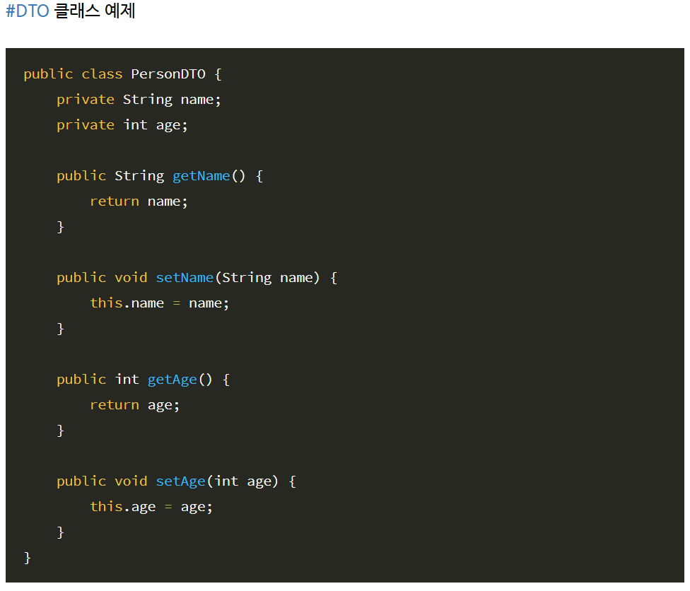

# JDBC 정의
+ JDBC 또는 Java Database Connectivity는 데이터베이스와 쿼리를 연결하고 실행하기 위한 Java API
+ JDBC 의 클랴스와 인터페이스를 사용하면, 유저가 작성한 요청(쿼리문)을 지정된 데이터베이스에 송신할 수 있다.
+ Java 데이터베이스 연결 표준을 갖춘 언어를 제공한다.
+ Java는 표준 인터페이스인 JDBC API를 제공한다.(즉, 어떤 DBMS를 사용하더라도 똑같은 방식으로 다룰 수 있음 = (데이터 베이스 종류에 상관없다.))
+ Java를 이용한 DB 접속과 SQL 문장 실행, 실행 결과로 얻어진 데이터의 핸들링을 제공하는 방법과 절차에 관한 규약을 정의한다.
+ 데이터베이스에 엑세스하는 데 필요한 프로그램을 작성하는 데 사용된다.

## JDBC 아키텍쳐

+ Appilcation : 데이터 소스와 통신하는 Java applet 또는 서블릿이다.
+ JDBC API : JDBC API를 사용하면 Java 프로그램이 SQL 문을 실행하고 결과를 가져올 수 있다.
+ JDBC Driver Maneger : JDBC 아키텍처에서 중요한 역할을 한다. 일부 데이터베이스 고유 드라이버를 사용하여 엔터프라이즈 애플리케이션을 데이터베이스에 효과적으로 연결한다.
+ JDBC Driver : JDBC 를 통해 데이터 소스와 통신하려면 각 데이터 소스와 유연하게 통신하는 JDBC 드라이버가 필요하다.

## JDBC 컴포넌트
: JDBC에는 일반적으로 데이터베이스와 상호 작용할 수 있는 4개의 주요 컴포넌트가 있다.
+ 1. JDBC API : 데이터베이스와 쉽게 통신할 수 있는 다양한 방법 및 인터페이스를 제공한다.(Java SE 및 Java EE 플랫폼에서 java.sql.* 를 제공한다)데이터베이스를 클라이언트 응용 프로그램에 연결하기 위한 표준을 제공함.
+ 2. JDBC 드라이버 매니저 : 데이터베이스와의 연결을 만들고, 데이터베이스 고유의 드라이버를 애플리케이션에 로드한다. 사용자 요청을 처리하기 위해 데이터베이스에 대한 데이터베이스 고유 호출에 사용한다.
+ 3. JDBC Test suite : JDBC 드라이버에 의해 수행되는 작업(삽인, 삭제, 업데이트 등)을 테스트하기 위해 사용된다.
+ 4. JDBC-ODBC Bridge Drivers : 데이터베이스 드라이버를 데이터베이스에 연결

## JDBC API
: JDBC API 는 다음 인터페이스와 클래스로 구성된다.
### Driver Manager
+ 데이터베이스 드라이버 목록을 관리하는 클래스이다. 이 클래스는 데이터베이스에 따라 다를 수 있다. Java 응용 프로그램의 연결 요청을 통신 하위 프로토콜을 사용하여 적절한 데이터베이스 드라이버와 일치시킨다.

### Driver
+ JDBC 드라이버는 Java 응용 프로그램이 데이터베이스와 상호 작용할 수 있도록 하는 인터페이스이다. 다른 데이터베이스에 접속하려면 데이터베이스별로 JDBC 드라이버가 필요하다. JDBC 드라이버는 데이터베이스에 접속하여 클라이언트와 데이터베이스 간에 쿼리 및 결과를 전송하기 위한 프로토콜을 구현한다.

### Connection
+ Connection Interface는 데이터베이스에 접속하기 위한 다양한 방법으로 구성된다.

### Statement
+ statement는 파싱되거나, 컴파일 또는 계획되거나(planned), 실행할 SQL 문을(데이터베이스로 전달될 SQL문)캡슐화합니다.

### Result Set
+ Result Set은 statement 개체를 사용하여 SQL(Structured Query Language) 쿼리를 실행할 때 데이터베이스에서 검색된 데이터를 유지한다. Result Set를 사용하여 데이터를 반복할 수 있다.

## JDBC API - 인터페이스
+ Driver interface
+ Connection interface
+ PreparedStatement interface
+ CallableStatement interface
+ ResultSet interface
+ ResultSetMetaData interface
+ DatabaseMetaData interface
+ RowSet interface

## JDBC API - 클래스
+ DriverManager class
+ Blob class
+ Clob class
+ Types class

-------

# DBMS 개념
+ DBMS란 **데이터베이스를 관리**해주는 시스템 입니다.즉, 응용 프로그램들이 데이터베이스를 공유하며 사용할 수 있는 환견을 제공해주는 소프트웨어 입니다. 
+ DB 구성, 정의, 유지 및 쿼리 언어 지원 등의 DB를 사용하기 위한 작업들을 관리합니다.

# DAO, DTO, VO 개념
## 1. DAO(Data Access Object)
+ 데이터베이스의 data에 접근하기 위한 객체이며 데이터베이스 접근을 하기 위한 로직과 비즈니스 로직을 분리하기 위해 사용한다.
+ 사용자는 자신이 필요한 Interface를 DAO에게 던지고 DAO는 이 Interface를 구현한 객체를 사용자에게 편리하게 사용할 수 있도록 반환한다.
+ DAO는 데이터베이스와 연결할 Connection까지 설정되어 있는 경우가 많다. 그래서 현제 쓰이는 MyBatis 등을 사용할 경우 커넥션풀까지 제공되고 있기 때문에 DAO를 별도로 만드는 경우는 드물다.

## 2. DTO(Data Transfer Object)
+ VO라고도 표현하며 계층 간 데이터 교환을 위한 자바 빈즈(Java Beans)이다. 
+ 데이터베이스 레코드의 데이터를 매핑하기 위한 데이터 객체를 말한다. 
+ DTO는 보통 로직을 가지고 있지않고 data와 그 data에 접근을 위한 getter, setter 만 가지고 있다.
+ DTO는 Database에서 Data를 얻어 Service나 Controller 등으로 보낼 때 사용하는 객체를 말한다.

+ 위의 클래스를 보면 getter/setter가 존재한다. 여기서 중요한 건 ***Property(프로퍼티)*** 개념인데 자바는 Property가 문법적으로 제공되지 않는다.
+ 자바에서 Property라는 개념을 사용하기 위해 지켜야 할 약속이 있는데 setter/getter에서 set과 get 이후에 나오는 단어가 Property라고 약속하는 것이다.그래서 위 클래스에서 프로퍼티는 **name** 과 **age** 이다.
+ **중요한 것은 프로퍼티가 멤버 변수 name, age로 결정되는 것이 아닌 getter/setter 에서의 name과 age임을 명심해야 한다.**
+ 즉, 멤버 변수는 아무렇게 지어도 영향이 없고 getter/setter로 프로퍼티(데이터)를 표현한다는 것이다.
+ 자바는 다양한 프레임워크에서 데이터 자동화 처리를 위해 리플렉션 기법을 사용하는데, 데이터 자동화 처리에서 제일 중요한 것은 표준 규격이다. 예를 들어 위 클래스 DTO에서 프로퍼티가 name, age 라면 name, age의 키값으로 들어온 데이터는 리플렉션 기법으로 setter 를 실행시켜 데이터를 넣을 수 있다. **중요한 것은, 개발자가 setter를 요청하는 것이 아닌 프레임워크 내부에서 setter가 실행된다는 점이다.**
+ 그래서 layer 간(특히 서버 => 뷰로 이동 등)에 데이터를 넘길 때 DTO를 쓰면 편하다는 것이 이런 이유 때문이다. 뷰에 있는 form에서 name 필드 값을 프로퍼티에 맞춰 넘겼을 때 받아야 하는 곳에서 일일이 처리하는 것이 아니라 name 속성의 이름과 매칭되는 프로퍼티에 자동적으로 DTO가 인스턴스화되어 *PersonDTO* 를 자료형으로 값을 받을 수 있다.

## 3. VO(Value Object)
+ VO는 DTO와 혼용해서 쓰이긴 하지만 미묘한 차이가 있다. VO는 값 오브젝트로써 값을 위해 쓰인다. 자바는 값 타입을 표현하기 위해 불변 클래스를 만들어 사용하는데, 불변이라는 것은 **read only** 특징을 가진다.
+ DTO와 VO의 공통점은 넣어진 데이터를 getter를 통해 사용하므로 주 목적은 같으나 DAO는 가변적인 성격을 가진 클래스이며(setter 활용) 그에 비해 VO는 불변의 성격을 가졌기에 차이점이 있다.

