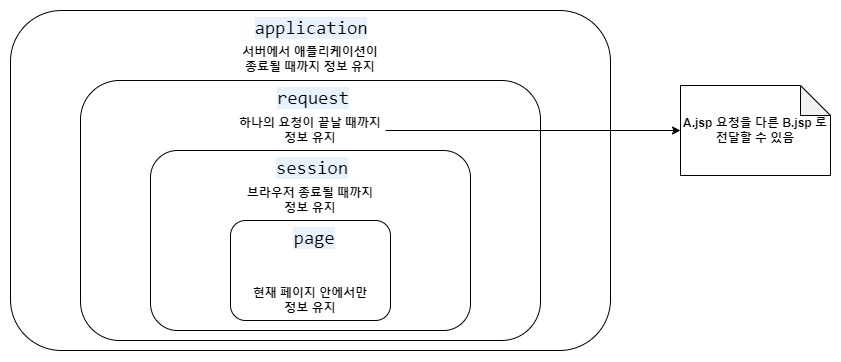

# JSP Scope란?
: JSP(JavaServer Pages)에서 "scope"란 변수의 유효 범위를 의미합니다. JSP는 웹 애플리케이션 개발 시 변수를 다양한 범위에서 사용할 수 있는데, 이렇게 변수가 사용 가능한 범위를 "scope"라고 합니다. JSP에서는 총 7가지의 스코프가 있습니다. 각각의 스코프는 변수의 생존 기간과 범위에 따라 다르게 동작합니다.  
***( Application > Session > Request > Page )***

## JSP의 Scope 중요 내장 객체 4가지 설명
1. **Page** : 페이지 내에서 지역변수처럼 사용한다.
	+ PageContext 추상 클래스를 사용한다.
	+ JSP 페이지에서 pageContext라는 내장 객체로 사용 가능 하다.
	+ forward 될 경우 해당 Page scope에 지정된 변수는 사용할 수 없다.
	+ 사용 방법은 다른 Scope와 같으나, 마치 지역변수처럼 사용된다는 것이 다른 Scope들과 다르다.
	+ page 내에서만 사용될 수 있는 변수기 때문에 지역 변수처럼 해당 JSP나 Servlet 실행되는 동안에만 정보를 유지하고자 할 때 사용한다.
	+ JSP에서 pageScope에 값을 저장한 후 해당 값을 EL표기법 등에서 사용할 때 사용할 수 있다.
2. **Request** : http 요청을 WAS 가 받아서 웹 브라우저에게 응답할 때까지 변수가 유지되는 경우 사용 
	+ http 요청을 WAS가 받아 웹 브라우저에 응답할 때까지 변수값을 유지하고자 할 경우 사용한다.
	+ HttpServletRequest 객체를 사용한다.
	+ JSP에서는 request 내장 변수를 사용하고, Servlet에서는 HttpServletRequest 객체를 사용한다.
	+ 값을 저장할 때는 request 객체의 setAttribute()메소드를 사용한다.
	+ 값을 읽어 들일 때는 request 객체의 getAttribute()메소드를 사용한다.
	+ forward 시 값을 유지하고자 사용한다.
3. **Session** : 웹 브라우저 별로 변수가 관리되는 경우 사용
	+ 웹 브라우저별로 변수를 관리하고자 할 경우 사용한다.
	+ 웹 브라우저 탭 간에는 세션정보가 공유되기 때문에, 각각의 탭에서 같은 세션정보를 사용할 수 있다.
	+ HttpSession 인터페이스를 구현한 객체를 사용한다.
	+ JSP에서는 session 내장 변수를 사용한다.
	+ Servlet에서는 HttpServletRequest의 getSession()메소드를 이용하여 session 객체를 얻는다.
	+ 값을 저장할 때는 session 객체의 setAttribute()메소드를 사용한다.
	+ 값을 읽어 들일 때는 session 객체의 getAttribute()메소드를 사용한다.
4. **Application** : 웹 어플리케이션이 시작되고 종료될 때까지 변수가 유지되는 경우 사용
	+ 웹 어플리케이션이 시작되고 종료될 때까지 변수를 사용할 수 있다.
	+ ServletContext 인터페이스를 구현한 객체를 사용한다.
	+ jsp에서는 application 내장 객체를 이용한다.
	+ Servlet에서는 getServletContext()메소드를 이용하여 application객체를 이용한다.
	+ 웹 어플리케이션 하나당 하나의 application객체가 사용된다.
	+ 값을 저장할 때는 application객체의 setAttribute()메소드를 사용한다.
	+ 값을 읽어 들일 때는 application객체의 getAttribute()메소드를 사용한다.
	+ 모든 클라이언트가 공통으로 사용해야 할 값들이 있을 때 사용한다.

## JSP의 Scope 내장 객체 종류 7가지
1. **pageContext (페이지 컨텍스트)** 
	+ 참조 타입: javax.servlet.jsp.PageContext
	+ 의미: 현재 JSP 페이지에 대한 정보와 기능을 제공하는 객체입니다.다른 내장 객체들의 역할을 포함하고 있으며, JSP 페이지에서 가장 상위의 내장 객체입니다.
2. **request (요청 객체)**
	+ 참조 타입: javax.servlet.http.HttpServletRequest
	+ 의미: 현재 요청에 대한 정보와 데이터를 제공하는 객체입니다.HTTP 요청과 관련된 매개변수, 헤더, 쿠키 등에 접근할 수 있습니다.
3. **session (세션 객체)**
	+ 참조 타입: javax.servlet.http.HttpSession
	+ 의미: 사용자 세션에 대한 정보와 데이터를 제공하는 객체입니다.사용자별로 유지되며, 로그인 상태나 사용자 설정과 같은 데이터를 저장할 때 사용됩니다.
4. **application (어플리케이션 객체)**
	+ 참조 타입: javax.servlet.ServletContext
	+ 의미: 웹 애플리케이션 전체에서 사용되는 정보와 데이터를 제공하는 객체입니다.모든 사용자 간에 공유되는 데이터를 저장하고 관리할 때 사용됩니다.
5. **out (출력 객체)**
	+ 참조 타입: javax.jsp.JspWriter
	+ 의미: 클라이언트로 출력을 생성하는 기능을 제공하는 객체입니다.HTML 코드나 텍스트를 생성하여 브라우저에 전송할 수 있습니다.
6. **config (서블릿 설정 객체)**
	+ 참조 타입: javax.servlet.ServletConfig
	+ 의미: 현재 서블릿의 설정 정보를 제공하는 객체입니다. 서블릿 초기화 매개변수를 읽을 때 사용됩니다.
7. **page (페이지 자신)**
	+ 참조 타입: java.lang.Object
	+ 의미: 현재 JSP 페이지를 나타내는 객체입니다. JSP 페이지 자체를 객체로 참조할 수 있습니다.

## Scope의 공통 함수
+ **setAttribute(string key,object value)** : key, value 형식으로 값을 할당한다.
+ **getAttribute(string key)** : key값으로 value값을 리턴 받는다.

