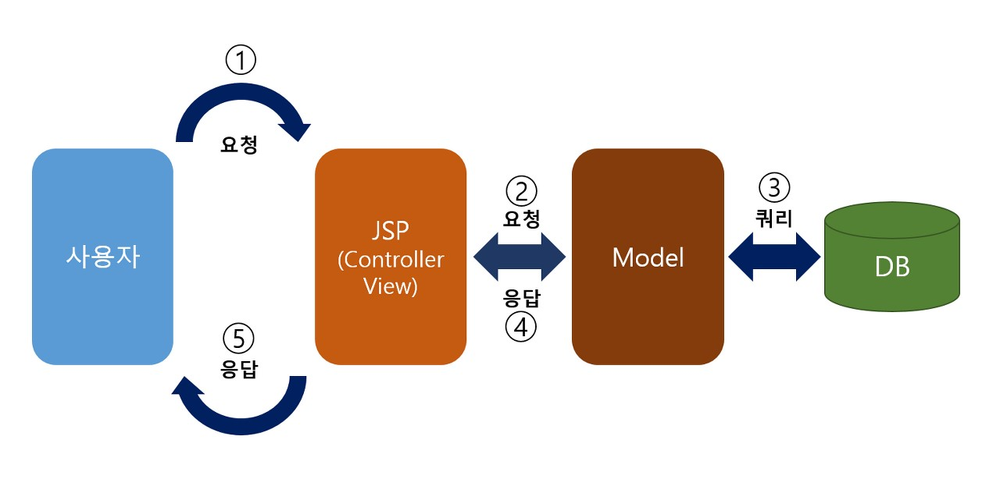
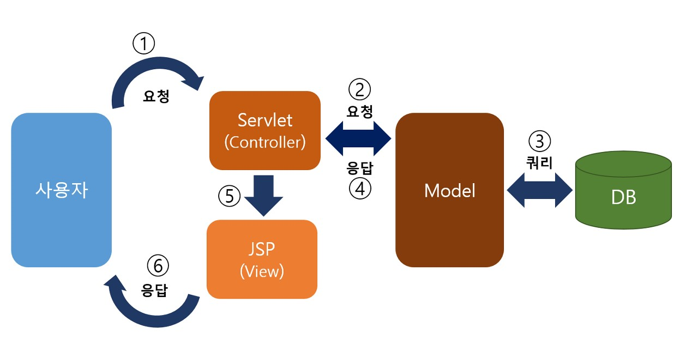

# MVC(Model-View-Controller) 패턴이란 ?
: MVC(Model-View-Controller) 패턴은 소프트웨어 디자인 패턴 중 하나로, 웹 애플리케이션의 구조를 분리하여 유지보수성을 향상시키고 코드 재사용성을 높이는데 도움을 줍니다. 
+ **Model** : 백그라운드에서 동작하며, 사용자가 원하는 데이터나 정보를 제공한다.
+ **View** : 사용자의 요청을 화면으로 출력한다.
+ **Controller** : 사용자의 요청을 처리하고, 그 요청에 따른 전체적인 흐름을 제어한다.  
*사용자는 **얻고자 하는 정보나 기능**을 **컨트롤러** 에게 요청한다.**컨트롤러** 는 사용자의 요청을 수신하고 그에 맞는 **비즈니스 로직을 수행** 한다.비즈니스 로직을 수행하면서 **컨트롤러** 는 필요에 따라 **모델을 호출하여 데이터를 요청** 한다.요청을 모두 처리하면 **뷰** 를 통해 사용자가 원하는 정보를 **시각적으로 보여준다**.(화면으로 출력)*

## MVC 모델1 아키텍처란?
: MVC 모델1 아키텍처는 서블릿(JSP) 기반의 웹 애플리케이션 아키텍처로, 비즈니스 로직과 프레젠테이션 로직이 서블릿과 JSP에서 모두 처리되는 형태입니다.

## MVC 모델1 구성 요소
1. **Model(모델)** : 비즈니스 로직을 처리하는 부분입니다. 데이터베이스와의 상호작용, 데이터 처리 등을 담당합니다.
2. **View(뷰)** : 프레젠테이션 로직을 처리하는 부분입니다. 사용자에게 보여지는 화면을 생성하고 표시합니다.
3. **Controller(컨트롤러)** : 클라이언트의 요청을 받아 Model과 View 사이의 흐름을 제어하는 부분입니다.

## MVC 모델1 단계별 구현:
1. **프로젝트 구조 설정**
    + WEB-INF 폴더 아래에 web.xml 파일을 생성하여 서블릿 매핑을 설정합니다.
2. **Model 구현**
    + Java 클래스를 사용하여 비즈니스 로직을 구현합니다.
    + 데이터베이스 연결, 데이터 처리 등을 수행합니다.
3. **View 구현**
    + JSP 파일을 사용하여 프레젠테이션 로직을 처리합니다.
    + HTML 및 JSP 태그를 사용하여 사용자에게 보여질 화면을 구성합니다.
4. **Controller 구현**
    + 서블릿 클래스를 사용하여 클라이언트의 요청을 처리하고 Model과 View 사이의 흐름을 제어합니다.
    + 클라이언트의 요청을 분석하고 해당 비즈니스 로직을 호출한 후 결과를 View에 전달합니다.  

***모델1 아키텍처를 구현하면, 비즈니스 로직과 프레젠테이션 로직이 분리되어 관리될 수 있고, 단순한 웹 애플리케이션에서는 효과적이다.***

## MVC 모델2 아키텍처란?
: MVC 모델2 아키텍처는 Model, View, Controller의 역할을 더욱 명확하게 분리하는 웹 애플리케이션 아키텍처입니다. 이 아키텍처는 웹 애플리케이션의 유지보수성과 확장성을 향상시키는데 도움을 줍니다.

## MVC 모델2 구성 요소
1. **Model(모델)**
    + 비즈니스 로직과 데이터 처리를 담당합니다.
    + 데이터베이스와의 상호작용, 데이터 처리, 데이터 유효성 검사 등이 포함됩니다.
    + 애플리케이션의 핵심 로직을 담당하며, 데이터의 변화나 조작을 다룹니다.
2. **View(뷰)**
    + 사용자 인터페이스를 표시하는 부분입니다.
    + HTML, JSP, CSS 등을 사용하여 실제 화면을 구성하고 사용자에게 표시됩니다.
    + 데이터의 시각적 표현이 이루어지며, 사용자에게 정보를 전달하고 시각적으로 보여줍니다.
3. **Controller(컨트롤러)**
    + 사용자의 입력 및 요청을 처리하고, 이에 따른 처리 방법을 결정합니다.
    + 사용자의 요청을 해석하여 Model의 로직을 호출하고, 처리 결과를 View에 전달합니다.
    + 웹 애플리케이션의 흐름을 제어하며, 클라이언트와 서버 간의 상호작용을 조율합니다.

## MVC 모델2 단계별 구현
1. **프로젝트 구조 설정**
    + 웹 애플리케이션 프로젝트를 생성하고 필요한 폴더 및 파일을 생성합니다.
2. **Model 구현**
    + Java 클래스를 사용하여 비즈니스 로직을 구현합니다.
    + 데이터베이스 연결, 데이터 처리 등을 담당합니다.
3. **View 구현**
    + JSP 파일을 사용하여 사용자 인터페이스를 구현합니다.
    + HTML, JSTL 태그 등을 사용하여 사용자에게 보여지는 화면을 만듭니다.
4. **Controller 구현**
    + 서블릿 클래스를 사용하여 클라이언트의 요청을 처리합니다.
    + 클라이언트의 요청을 분석하고 해당 비즈니스 로직을 호출한 후 결과를 전달합니다.
    + 결과를 저장하고 다음에 보여질 View를 결정합니다.
5. **URL 매핑 및 포워딩**
    + web.xml 파일에서 서블릿 매핑을 설정하여 클라이언트의 요청을 해당 컨트롤러로 전달합니다.
    + 컨트롤러는 비즈니스 로직을 수행하고 결과를 저장한 후, JSP로 포워딩하여 화면을 보여줍니다.
6. **뷰와 컨트롤러 연결**
    + 컨트롤러에서 비즈니스 로직을 수행한 결과를 request나 session 객체에 저장합니다.
    + 이후 JSP 파일에서 해당 객체를 사용하여 데이터를 출력하거나 화면을 구성합니다.
7. **실행 흐름**
    + 클라이언트의 요청이 들어오면 web.xml에서 설정한 서블릿 매핑을 통해 컨트롤러가 호출됩니다.
    + 컨트롤러는 비즈니스 로직을 처리하고 결과를 저장한 후, 적절한 JSP로 포워딩하여 화면을 보여줍니다.  

***MVC 모델2 아키텍처를 구현하면 비즈니스 로직, 프레젠테이션 로직, 요청 처리 로직이 분리되어 관리됩니다. 이를 통해 코드의 가독성과 유지보수성을 높일 수 있습니다.***